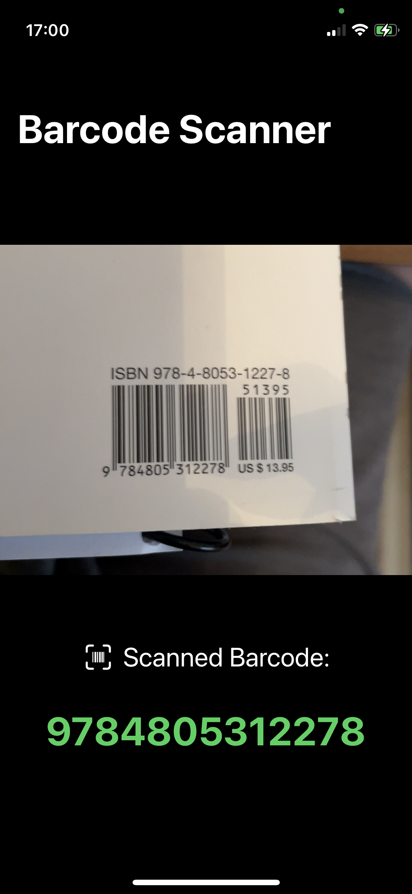

# barcode-scanner
A simple app to scan barcodes, made in SwiftUI - Sean Allen's course.  
UIKit and SwiftUI integration  
MVVM  
Coordinator  

## Using
Just clone this repository, build and test it.
